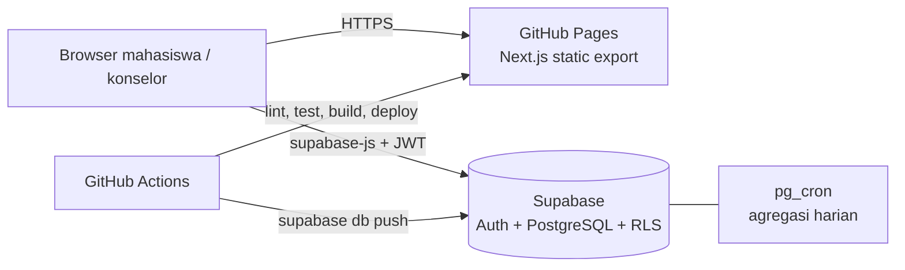

# Instride

Platform pemantauan wellbeing mahasiswa: mood tracker & jurnal harian dengan analisis sentimen AI (IndoBERT), serta Campus Dashboard agregat & anonim untuk unit konseling.

- Aplikasi: https://dnday.github.io/Instride/app/
- Halaman kelompok: https://dnday.github.io/Instride/

## Arsitektur



- **Frontend**: Next.js 14 (App Router, `output: 'export'`) + Tailwind CSS, disajikan di `/Instride/app`.
- **Backend**: Supabase. Tidak ada server sendiri; keamanan data ditegakkan di database lewat Row Level Security.
- **Privasi**: konselor hanya mengakses `campus_wellbeing_stats()`, yaitu agregat mingguan dengan k-anonymity (k = 5). Periode atau metrik yang berasal dari kurang dari 5 mahasiswa tidak ditampilkan.

## Setup lokal

Butuh Node.js 20+.

```bash
npm install
cp .env.example .env.local   # isi NEXT_PUBLIC_SUPABASE_ANON_KEY (Supabase -> Project Settings -> API)
npm run dev                  # http://localhost:3000
```

| Perintah | Fungsi |
|---|---|
| `npm run dev` | Server development |
| `npm run lint` | ESLint |
| `npm run test:run` | Unit test (Vitest), termasuk uji database (RLS, k-anonymity, trigger signup, agregasi) terhadap semua migration memakai PostgreSQL in-memory, tanpa perlu koneksi Supabase |
| `npm run build` | Build static ke `out/` |

## Database

Skema ada di `supabase/migrations/` dan diterapkan **otomatis oleh CI** saat merge ke `main`. Jangan mengubah skema lewat SQL Editor, supaya riwayat migrasi tetap konsisten.

Menambah perubahan skema:

1. Buat file baru `supabase/migrations/<YYYYMMDDHHMMSS>_<nama>.sql`.
2. Tambahkan test di `tests/database.test.mjs` dan pastikan `npm run test:run` lulus.
3. Merge ke `main`. Job `migrate` akan menjalankan `supabase db push`.

| Objek | Keterangan |
|---|---|
| `users`, `moods`, `journals`, `sentiment_analysis` | Data pribadi; tiap mahasiswa hanya bisa mengakses miliknya sendiri |
| `wellbeing_aggregation` | Arsip agregat mingguan, diperbarui `pg_cron` setiap hari 00:05 WIB, hanya bisa dibaca konselor/admin |
| `campus_wellbeing_stats()` | Agregat real-time untuk Campus Dashboard (konselor/admin) |
| Trigger `on_auth_user_created` | Membuat profil `users` (role `mahasiswa`) saat signup |

Akun konselor dibuat dengan mendaftar biasa, lalu admin mengubah kolom `role` menjadi `konselor` lewat Table Editor Supabase.

## CI/CD

`.github/workflows/main.yml` terdiri dari tiga job:

1. **build**: lint, test, build aplikasi dan halaman kelompok (`docs/`). Pada pull request hanya job ini yang berjalan.
2. **migrate**: `supabase db push` ke project produksi.
3. **deploy**: publikasi ke GitHub Pages.

Secrets yang dibutuhkan: `NEXT_PUBLIC_SUPABASE_URL`, `NEXT_PUBLIC_SUPABASE_ANON_KEY`, `SUPABASE_PROJECT_REF`, `SUPABASE_DB_PASSWORD`, `SUPABASE_ACCESS_TOKEN`.

## Dokumentasi

- [API Specification](API_SPEC.md)
- [Validation Rules](VALIDATION_RULES.md)
- [Test Cases](TEST_CASES.md)

## Tim

| Nama | NIM | Peran |
|---|---|---|
| Marcelinus Dinoglide Yoga Prakoso | 24/533842/TK/59152 | Project Manager, Cloud Engineer |
| Muhammad Izzuddin Prakoso | 24/537712/TK/59618 | Software Engineer |
| Raka Bagus Samudra | 24/543213/TK/60349 | AI Engineer, UI/UX Designer |
